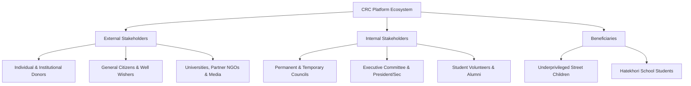

# 2. Stakeholder Analysis & Requirements Matrix

> **Document Code**: `CRC-DOC-02`  
> **Standard**: IEEE 830 Stakeholder Requirements  
> **Status**: APPROVED  

---

## 2.1 Stakeholder Identification & Classification

---

## 2.2 Stakeholder Requirements Matrix

| Stakeholder Role | Influence / Interest | Primary Needs & Functional Expectations | Acceptance Criteria |
| :--- | :--- | :--- | :--- |
| **Donors (Local & Overseas)** | High / High | • Seamless donation via bKash/Nagad/Cards/Stripe. • Instant downloadable donation receipt/voucher. • Access to audited financial statements. | • Transaction completed in $< 3$ steps. • Public audit PDF verified in 1 click. |
| **CRC Leadership (Councils)** | High / High | • Published governance roster (Permanent/Executive/Temporary). • Real-time member registry with automated `.xlsx` export. • Nightly automated database backup to Google Drive. | • 100% role-based access control. • Zero data loss guarantee via 3-Tier DR. |
| **Volunteers & Students** | Medium / High | • Online membership application and status tracking. • Event calendar and branch coordinator contacts. • Activity updates and certificates. | • Mobile-friendly registration form ($< 2$ mins). |
| **Underprivileged Children & Guardians** | Low / High | • Dignified representation (no exploitative photography). • Access to Hatekhori School curriculum and relief distribution schedules. | • Strict adherence to CRC Child Safeguarding Policy. |
| **Concern Reporters (Public / Whistleblowers)** | Medium / Medium | • Secure, anonymous or confidential "Report a Concern" submission form. • Anti-retaliation assurance. | • Encrypted transmission to designated officer. |
| **System Administrators** | High / Medium | • Intuitive dashboard to post notices, news, and upload PDFs. • Direct automated sync of assets to Google Drive. | • Automated file propagation without technical scripts. |
