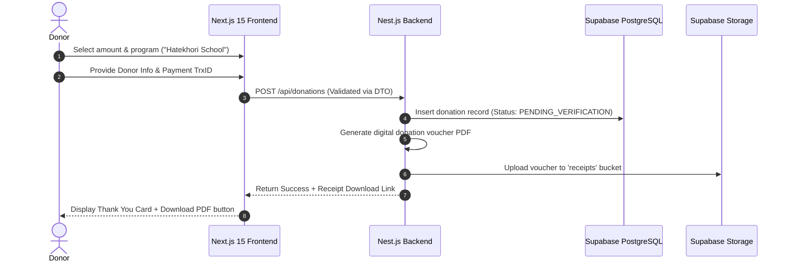
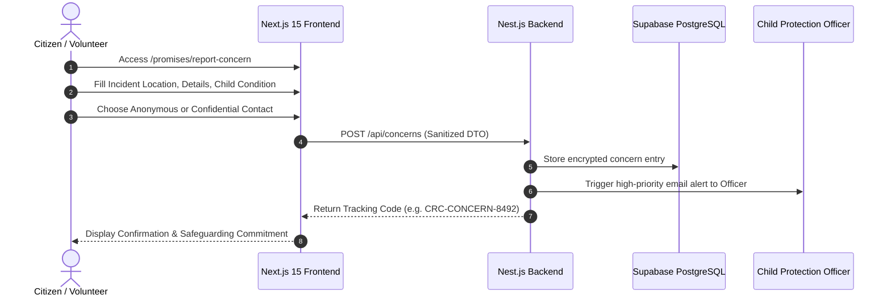
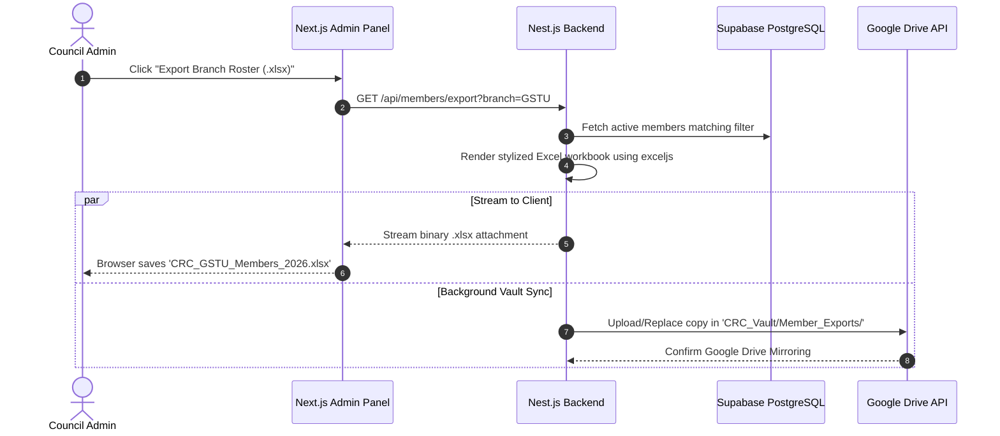

# 7. Requirement Modeling & Use Case Specifications

> **Document Code**: `CRC-DOC-07`  
> **Status**: APPROVED  

---

## 7.1 Core User Stories

| Story ID | As a... | I want to... | So that... |
| :--- | :--- | :--- | :--- |
| **US-01** | General Donor | Easily make a donation via bKash/Nagad/Card and get a receipt | I can support underprivileged street children transparently. |
| **US-02** | Child Sponsor | Sponsor a specific student at Hatekhori School monthly | I can track my sponsored child's educational progress. |
| **US-03** | University Student | Apply for volunteer membership at my campus branch | I can participate in social welfare and community development. |
| **US-04** | Citizen / Bystander | Report a street child in distress anonymously | CRC can provide immediate medical/shelter/educational rescue. |
| **US-05** | Council Secretary | Export the entire member roster into a styled Excel file | I can present the official registry during general meetings. |
| **US-06** | Transparency Auditor | Download annual external audit reports in PDF | I can verify financial accountability and donor fund utilization. |

---

## 7.2 Use Case Specification: UC-01 Process Donation

---

## 7.3 Use Case Specification: UC-02 Child Safeguarding Concern Report

---

## 7.4 Use Case Specification: UC-03 Member Dynamic Excel Export & Drive Sync

