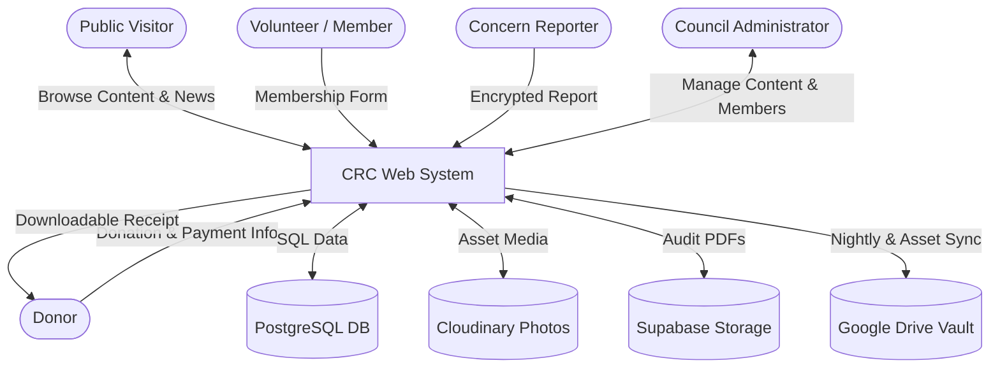
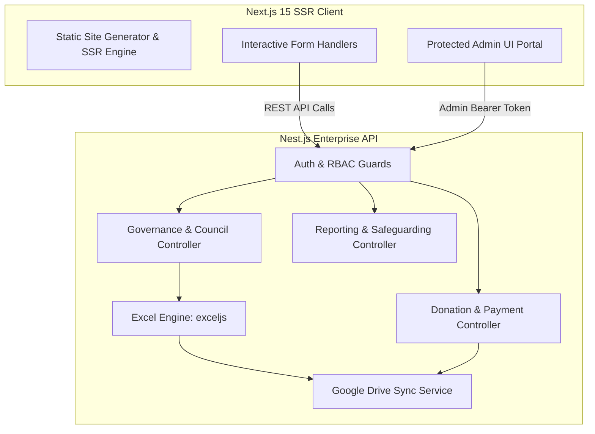
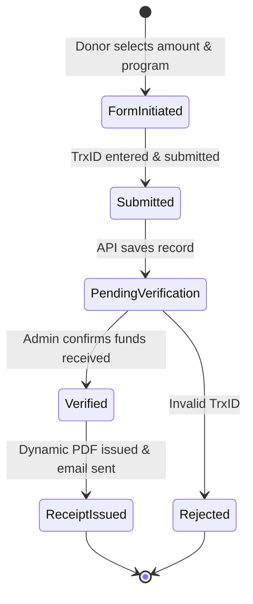

# 8. System Analysis & Architecture Diagrams

> **Document Code**: `CRC-DOC-08`  
> **Status**: APPROVED  

---

## 8.1 Data Flow Diagram (DFD Level 0: Context Diagram)

---

## 8.2 Data Flow Diagram (DFD Level 1: Subsystem Decomposition)

---

## 8.3 State Transition Diagram: Donation Lifecycle

