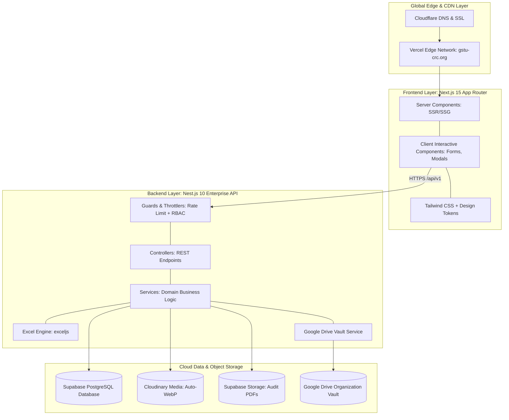

# 9. System Design & Technical Architecture

> **Document Code**: `CRC-DOC-09`  
> **Status**: APPROVED  

---

## 9.1 High-Level Architectural Pattern

The CRC Platform utilizes a **Decoupled Client-Server Monorepo Architecture** optimized for high SEO performance, sub-second latency, zero-maintenance operational cost, and strict type safety across the stack.

---

## 9.2 Technology Stack Bill of Materials (BOM)

| Component | Technology | Version | Key Architectural Responsibility |
| :--- | :--- | :--- | :--- |
| **Frontend Framework** | Next.js (React 19) | 15.x | Server-Side Rendering (SSR), SEO Metadata, OpenGraph cards. |
| **Styling & Motion** | Tailwind CSS + Framer Motion | 3.4+ / 11+ | High-density curated design tokens, glassmorphism, micro-interactions. |
| **Backend Framework** | Nest.js (Express) | 10.x | Enterprise MVC architecture, strict DTOs, Swagger documentation. |
| **Database ORM** | Prisma ORM | 5.x / 6.x | Type-safe migrations, auto-generated TypeScript client. |
| **Primary Database** | PostgreSQL (Supabase) | 15+ | Relational data integrity, ACID compliance, Row-Level Security. |
| **Media Pipeline** | Cloudinary SDK | Latest | Automatic WebP/AVIF compression, face-detection avatar cropping. |
| **Document Storage** | Supabase Storage | S3-API | Fast CDN download of audit reports, constitution, and circulars. |
| **Spreadsheet Engine** | exceljs | 4.x | Real-time memory-efficient generation of stylized `.xlsx` workbooks. |
| **Drive Synchronization** | Google APIs (googleapis) | Latest | Background mirroring of docs and database dumps via Service Account. |
| **Documentation Format** | Multi-Format (.docx, .md, .txt) | IEEE 830 | Multi-stakeholder documentation framework. |

---

## 9.3 Security Perimeters & Defense-in-Depth

1. **Edge Perimeter**: Cloudflare & Vercel DDoS mitigation, HTTP/3, TLS 1.3, Strict Content Security Policy (CSP).
2. **API Perimeter**: Helmet security headers, CORS origin restriction (only allowing `https://gstu-crc.org`), Nest.js Throttler (Rate-Limiting: 100 req/min per IP to prevent spam attacks).
3. **Data Perimeter**: Class-validator DTO allowlists rejecting unwhitelisted fields; database access restricted via Prisma parameterization (100% SQL-injection immune).
