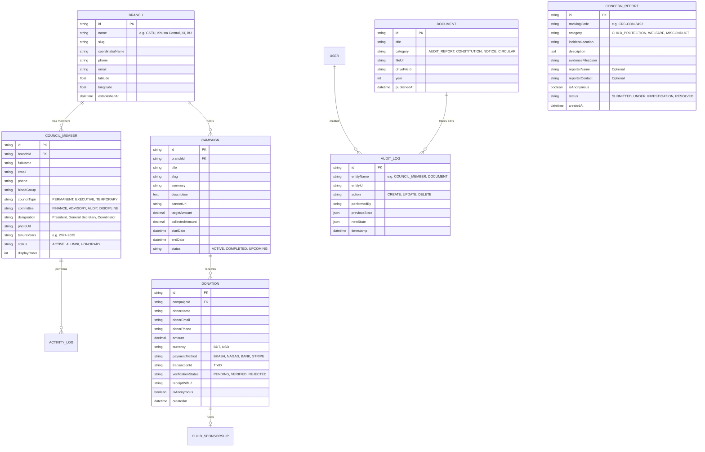

# 10. Database Design & Entity Relationship Specifications

> **Document Code**: `CRC-DOC-10`  
> **Database Engine**: PostgreSQL 15+ (Hosted on Supabase)  
> **ORM Layer**: Prisma ORM with automated migrations  
> **Status**: APPROVED  

---

## 10.1 Entity-Relationship Diagram (ERD)



---

## 10.2 Production Prisma Schema Blueprint

```prisma
datasource db {
  provider = "postgresql"
  url      = env("DATABASE_URL")
}

generator client {
  provider = "prisma-client-js"
}

enum CouncilType {
  PERMANENT
  EXECUTIVE
  TEMPORARY
}

enum MemberStatus {
  ACTIVE
  ALUMNI
  HONORARY
  INACTIVE
}

enum DonationStatus {
  PENDING
  VERIFIED
  REJECTED
}

enum ConcernCategory {
  CHILD_PROTECTION
  WELFARE_NEED
  ORGANIZATIONAL_MISCONDUCT
  FINANCIAL_IRREGULARITY
}

enum ConcernStatus {
  SUBMITTED
  UNDER_REVIEW
  IN_PROGRESS
  RESOLVED
}

enum DocumentCategory {
  AUDIT_REPORT
  STATUTORY_CONSTITUTION
  NOTICE
  ANNUAL_REPORT
}

model Branch {
  id              String          @id @default(cuid())
  name            String          @unique
  slug            String          @unique
  coordinatorName String
  phone           String
  email           String
  latitude        Float?
  longitude       Float?
  address         String
  establishedAt   DateTime
  members         CouncilMember[]
  campaigns       Campaign[]
  createdAt       DateTime        @default(now())
  updatedAt       DateTime        @updatedAt
}

model CouncilMember {
  id           String       @id @default(cuid())
  branchId     String
  branch       Branch       @relation(fields: [branchId], references: [id])
  fullName     String
  email        String
  phone        String
  bloodGroup   String?
  councilType  CouncilType
  committee    String?
  designation  String
  photoUrl     String?
  tenureYears  String
  status       MemberStatus @default(ACTIVE)
  displayOrder Int          @default(0)
  createdAt    DateTime     @default(now())
  updatedAt    DateTime     @updatedAt

  @@index([councilType, status])
  @@index([branchId])
}

model Campaign {
  id              String         @id @default(cuid())
  branchId        String?
  branch          Branch?        @relation(fields: [branchId], references: [id])
  title           String
  slug            String         @unique
  summary         String
  description     String         @db.Text
  bannerUrl       String
  targetAmount    Decimal?       @db.Decimal(12, 2)
  collectedAmount Decimal        @default(0.00) @db.Decimal(12, 2)
  startDate       DateTime
  endDate         DateTime?
  isActive        Boolean        @default(true)
  donations       Donation[]
  createdAt       DateTime       @default(now())
  updatedAt       DateTime       @updatedAt
}

model Donation {
  id                 String         @id @default(cuid())
  campaignId         String?
  campaign           Campaign?      @relation(fields: [campaignId], references: [id])
  donorName          String
  donorEmail         String?
  donorPhone         String?
  amount             Decimal        @db.Decimal(10, 2)
  currency           String         @default("BDT")
  paymentMethod      String         // BKASH, NAGAD, BANK, STRIPE
  transactionId      String         @unique
  verificationStatus DonationStatus @default(PENDING)
  receiptPdfUrl      String?
  isAnonymous        Boolean        @default(false)
  createdAt          DateTime       @default(now())
  updatedAt          DateTime       @updatedAt

  @@index([transactionId])
  @@index([verificationStatus])
}

model ConcernReport {
  id               String          @id @default(cuid())
  trackingCode     String          @unique
  category         ConcernCategory
  incidentLocation String
  description      String          @db.Text
  evidenceFiles    Json?
  reporterName     String?
  reporterContact  String?
  isAnonymous      Boolean         @default(true)
  status           ConcernStatus   @default(SUBMITTED)
  adminNotes       String?         @db.Text
  createdAt        DateTime        @default(now())
  updatedAt        DateTime        @updatedAt

  @@index([trackingCode])
}

model Document {
  id          String           @id @default(cuid())
  title       String
  category    DocumentCategory
  fileUrl     String
  driveFileId String?
  fileSize    Int
  year        Int
  publishedAt DateTime         @default(now())
  createdAt   DateTime         @default(now())
  updatedAt   DateTime         @updatedAt

  @@index([category, year])
}

model AuditLog {
  id          String   @id @default(cuid())
  entityName  String
  entityId    String
  action      String   // CREATE, UPDATE, DELETE
  performedBy String
  details     Json?
  timestamp   DateTime @default(now())

  @@index([entityName, timestamp])
}
```
