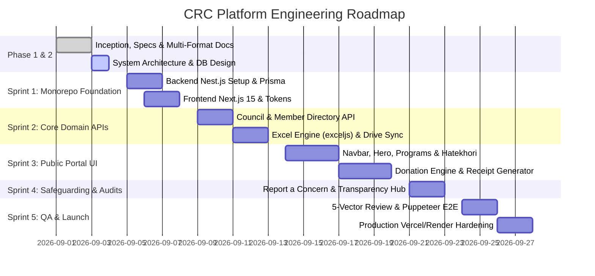

# 13. Development Plan & Sprint Milestones

> **Document Code**: `CRC-DOC-13`  
> **Methodology**: Agile Sprints with Strict Verification & Automated Testing  
> **Status**: APPROVED  

---

## 13.1 Milestone Roadmap Breakdown

---

## 13.2 Sprint Deliverables Table

| Sprint | Focus Area | Key Deliverables | Verification Gateway |
| :--- | :--- | :--- | :--- |
| **Sprint 1** | Monorepo Scaffolding | `backend/` (Nest.js + Prisma) + `frontend/` (Next.js 15). | Local dev servers build with zero errors. |
| **Sprint 2** | Enterprise APIs & Excel | Council API, Branch API, `exceljs` dynamic streaming, Google Drive background sync. | Swagger tests pass (`/api/docs`), generated Excel verified. |
| **Sprint 3** | Core Public Web UI | Design system layout, Navbar, Hero, Hatekhori School page, Donation UI with bKash/Nagad. | Mobile & Desktop responsive layout audit $\ge 90$. |
| **Sprint 4** | Promises & Audits | "Report a Concern" encrypted form, Financial Transparency center with PDF downloads. | Whistleblower encryption & email notification verified. |
| **Sprint 5** | Production & QA | 5-Vector review, Puppeteer E2E tests, domain `gstu-crc.org` SSL, Google Search Console. | Core Web Vitals $\ge 90$, 3-tier backup tested. |
